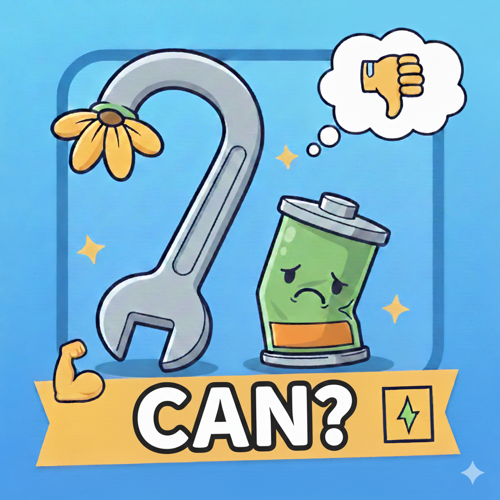

# 行不行 (Can Or Not Can) - 男性健康私密评测系统

<br>
行不行<br>
是一款基于 Electron + Vue 3 构建的桌面端跨平台应用。它旨在通过数字化临床量表，帮助男性在完全私密的环境下评估其勃起功能、射精控制力及下尿路症状。
---
## 一、核心特性
**数据主权（Local-First）** 所有评测数据仅保存在用户本地设备，不上传任何云端服务器。
**临床深度评测** 基于 IIEF-5、PEDT、IPSS 三大标准，并科学扩展至 25 题详尽版。
**趋势分析看板** 多维度雷达图展示当前状态，动态折线图追踪生理机能波动。
项目强调隐私安全、轻量架构与可扩展性，适合个人使用或二次开发。
---
## 二、技术栈
- Electron（桌面容器）
- React 18
- Vite
- TypeScript
- Tailwind CSS
- Node.js / npm
---
## 三、临床标准与计分逻辑
IIEF-25 (勃起功能指数扩展版):
  核心维度：勃起信心、插入硬度、维持能力、恢复频率、心理满意度
  严重程度划分：$26-30$ 分（正常），$1-10$ 分（重度障碍）
PEDT-25 (射精控制评测扩展版):
  核心维度：控制感、潜伏期感知、挫败感、伴侣影响、适应性训练。
IPSS-25 (下尿路症状评测扩展版):
  核心维度：阻塞症状（尿无力、费力）、刺激症状（尿频、尿急）、盆腔疼痛、生活质量 (QoL) 。
## 三、项目结构
```text
maleCanOrNotCan/
├── electron/
│   └── main.js      # Electron 主进程
├── public/
│   └── icon.png
├── index.html
├── index.tsx
├── index.css
├── metadata.json
├── package.json
├── vite.config.ts
├── tailwind.config.js
├── postcss.config.js
├── tsconfig.json
└── README.md
```
---
## 四、运行环境要求
- Node.js >= 18
- npm >= 9
- Windows / macOS（已验证）
---

## 五、安装与运行
### 1. 安装依赖
```bash
npm install
```
### 2. 启动开发模式
```bash
npm run dev
```
### 3. 启动桌面应用
```bash
npm run electron:dev
``
---
## 六、构建发布版本
前端项目打包
```bash
npm run build
```
桌面项目打包
windows-exe程序打包 指定了64位电脑版本
```bash 
npm run electron:build:win
```
mac-dmg程序打包
```bash
npm run electron:build:mac
```

构建产物位于 `dist/` 目录，可用于桌面打包。
安装包位于 `dist_electron/` 目录，可用于发布。
---
## 六、可扩展方向
- 问卷配置化（JSON/Schema）
- 本地历史记录存储
- IPC 通信增强
- 自动更新机制
- 多语言支持
---
## 七、免责声明
本项目仅用于健康评估参考，不构成任何医疗建议。如有健康问题，请咨询专业医生。
---
## 八、License
Apache License
